<!--
SPDX-FileCopyrightText: 2026 Arcangelo Massari <arcangelo.massari@unibo.it>

SPDX-License-Identifier: ISC
-->

# KROWN

This benchmark runs 58 scenarios generated by [KROWN](https://github.com/kg-construct/KROWN) pinned at [`824438c`](https://github.com/kg-construct/KROWN/commit/824438c6cc33bc7bb78a05d8ba4c16af4d4aba5e). The catalog is read from its RMLMapper configurations for `RawData`, `Mappings`, `NamedGraph`, `JoinsRelation`, and `JoinsMultiple`. It uses the scales documented in the KROWN 0.9.0 results ([DOI: 10.5281/zenodo.10973892](https://doi.org/10.5281/zenodo.10973892)). The `1-1` relation and one-join-condition scales are absent from those configuration files, so the adapter adds those two cases explicitly and records the overlay in the result provenance.

The forward phase is executed by KROWN's `Executor`: it discovers the generated metadata, starts KROWN's PostgreSQL resource, loads the source data, invokes RMLMapper, collects system metrics, preserves the generated RDF, and applies KROWN's 15-second cooldown. The adapter selects a locally built RMLMapper v8.1.0 image without modifying the KROWN submodule.

KROWN does not provide an inversion resource. For the backward phase, the adapter loads the same generated CSV files into separate source and destination schemas, invokes the selected inversion engine, and performs round-trip validation. This phase uses KROWN's `Collector` and `Stats` classes directly, including the same 15-second cooldown. Local code also produces the JSON summaries and plots.

TM denotes a Triples Map; POM, a Predicate-Object Map; NG, a Named Graph Map; and SM, a Subject Map.

| Scenario | Parameter values |
| --- | --- |
| Raw data: rows | 10K, 100K, 1M, 10M |
| Raw data: columns | 1, 10, 20, 30 |
| Raw data: cell size | 500, 1K, 5K, 10K |
| Mappings: TMs + 5 POMs | 1, 10, 20, 30 TMs |
| Mappings: 20 TMs + POMs | 1, 3, 5, 10 POMs |
| Mappings: NG in SM | 1, 5, 10, 15 NGs |
| Mappings: NG in POM | 1, 5, 10, 15 NGs |
| Mappings: NG in SM/POM | 1/1, 5/5, 10/10, 15/15 NGs |
| Joins: 1-N relations | 1-1, 1-5, 1-10, 1-15 |
| Joins: N-1 relations | 1-1, 5-1, 10-1, 15-1 |
| Joins: N-M relations | 3-3, 3-5, 5-3, 10-5, 5-10 |
| Joins: join conditions | 1, 5, 10, 15 |

Duplicate and empty-value scenarios, including `JoinsDuplicate`, are excluded: RDF does not preserve duplicate rows, and empty values in subject templates can suppress rows.

## Validation

`RawData` exposes every source column, so its reconstructed tables must match the originals and return `FULL`.

The other suites omit source information. A recoverable scenario passes with `PARTIAL` only when its reconstructed columns are ordered subsets of the originals, contain no values absent from the corresponding source rows, and reproduce the same RDF dataset when mapped again.

Mapping scenarios with more TMs than POMs must return `NON_INVERTIBLE` because identical subject templates cannot be assigned unambiguously to source columns. The `1 TM + 5 POM` scenario remains recoverable and must return `PARTIAL`. For rejected scenarios, inversion time is the time to rejection and throughput is omitted.

Reported timings exclude validation. Results include source size, RDF statement counts, mapping structure, throughput, validation losses, summary statistics, and 95% confidence intervals.

## Inversion engines

`KROWN_ENGINE` selects which implementation performs the backward phase. Both receive the same mapping and the same RDF graph produced by the forward phase, write into the same destination schema, and are checked by the same validator.

| Engine | Implementation |
| --- | --- |
| `kgi` | the local implementation, which generates SPARQL queries from the mapping |
| `souffle` | the Datalog approach of [KROWN_Extended](https://github.com/alloka/KROWN_Extended) |

## Measurement modes

Set `KROWN_MODE` to one of these values:

| Mode | Measured work | Work outside measurement |
| --- | --- | --- |
| `forward` | KROWN `Executor` mapping step | generation and local validation |
| `backward` | inversion under KROWN `Collector` | generation, one KROWN forward run used to prepare the RDF input, local database setup, and validation |
| `roundtrip` | KROWN `Executor` mapping step and the paired inversion measurement | generation, local database setup, and validation |

The reported stage durations come from KROWN's `metrics.csv`: they are the difference between the first and last sample for that step, matching the duration calculation in KROWN `Stats`. The forward and backward phases keep separate metric files because only the forward phase can be represented by an unmodified KROWN scenario. In `roundtrip` mode, the runner pairs each forward iteration with the corresponding backward iteration and reports inversion overhead as `inversion time / forward time × 100`.

The official KROWN collector runs on the Linux host with a default sampling interval of 0.1 seconds. Its CPU, RAM, swap, disk, and network values describe the whole host, not an isolated benchmark process. Run the benchmark without unrelated workloads when comparing machines or revisions.

## Legacy results

The checkpoint collected on 16 July 2026 used the earlier local runner and one iteration per scenario. The [raw results](results/krown_benchmark_results_raw_2026-07-16.json) and [aggregated statistics](results/krown_benchmark_results_stats_2026-07-16.json) remain available for historical comparison. Their timing and resource fields are not directly comparable with runs produced by the aligned adapter.

| Outcome | Scenarios |
| --- | ---: |
| `FULL` | 8 |
| `PARTIAL` | 13 |
| `NON_INVERTIBLE` | 6 |
| `OUT_OF_MEMORY` | 11 |
| `TIMEOUT` | 3 |
| `FAILED` | 17 |

Of the 31 failed scenarios, 15 failed during forward mapping: 11 ran out of memory, three timed out, and one ended after a Java Virtual Machine crash. The official RMLMapper/PostgreSQL results also report resource limits for the same configurations: out-of-memory failures for 10 million rows and value sizes of 5,000 and 10,000 characters, and timeouts for named-graph scenarios and join-condition cases with 5, 10, or 15 conditions. See the [KROWN record](https://zenodo.org/records/10973892).

The other 16 failures are RDF round-trip mismatches after forward mapping completed. They remain recorded as failures pending investigation.

### Raw data

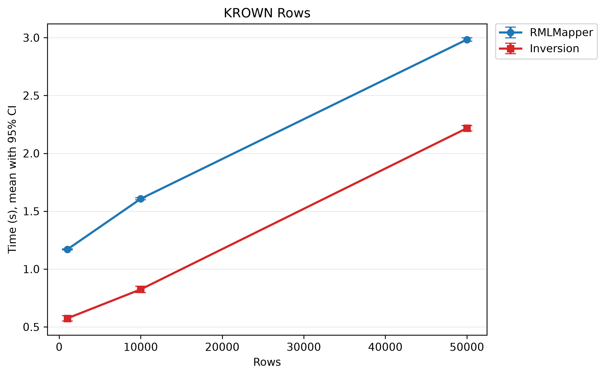

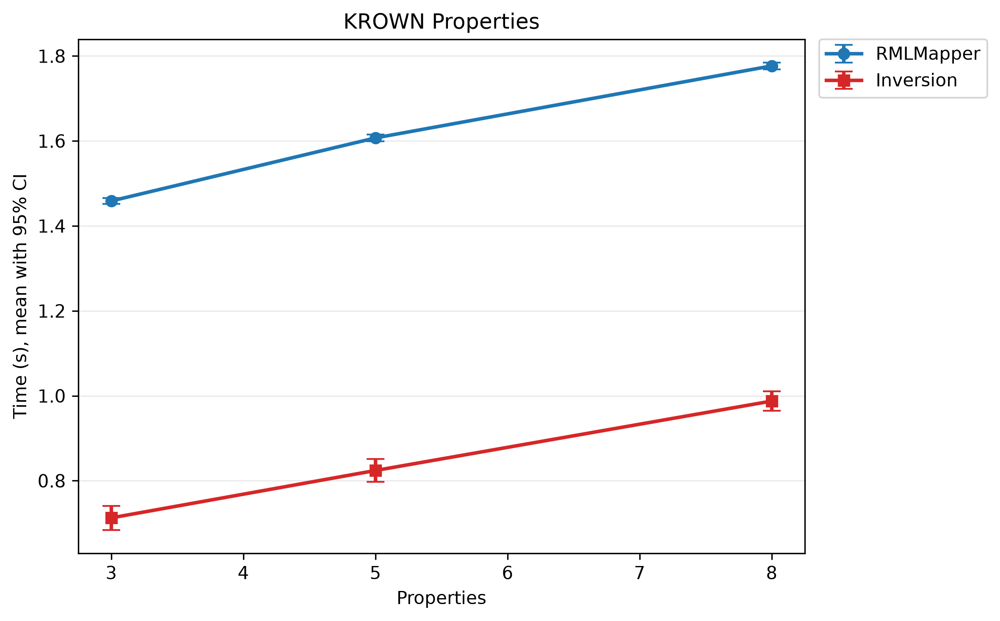

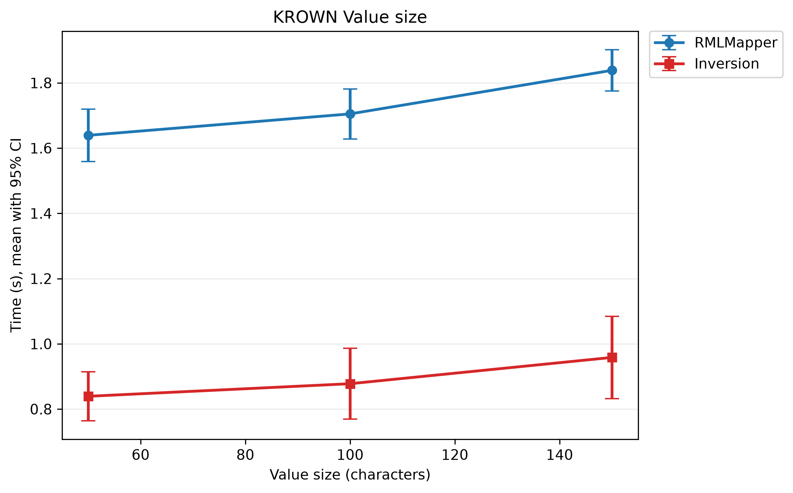

### Mappings

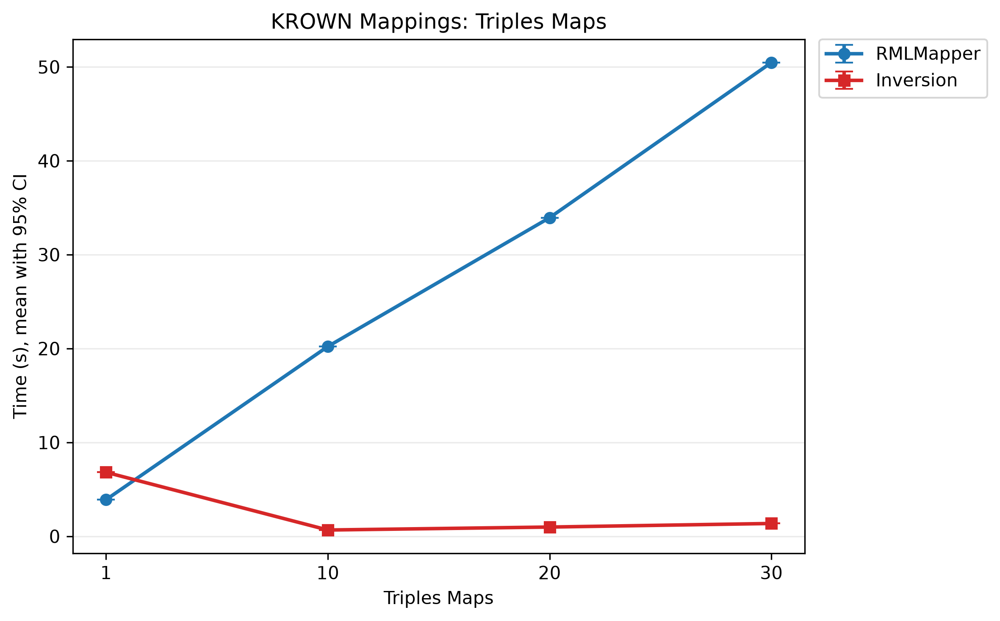

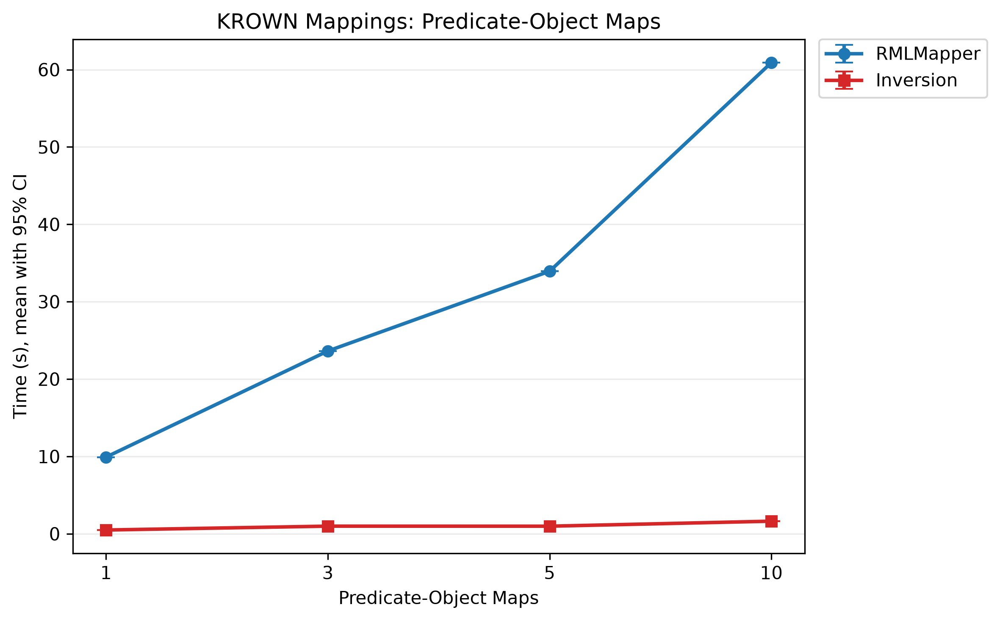

### Named graphs

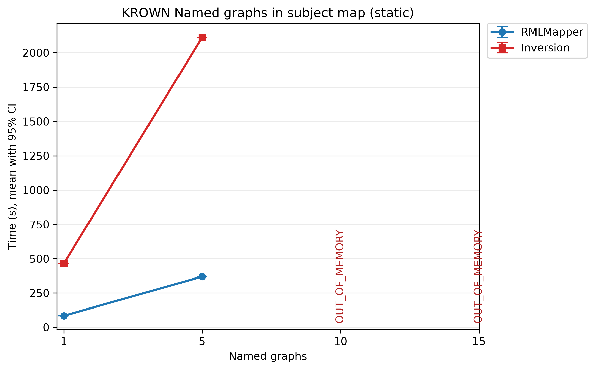

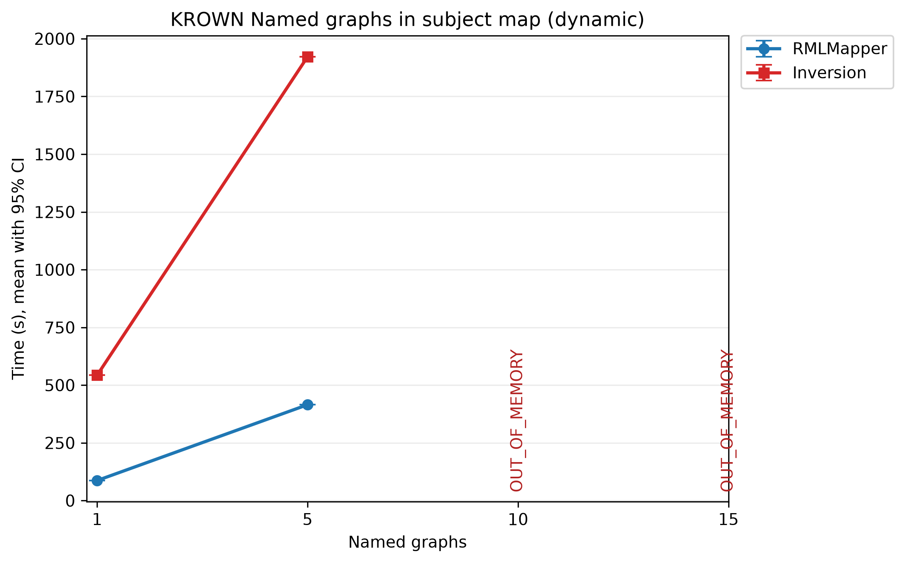

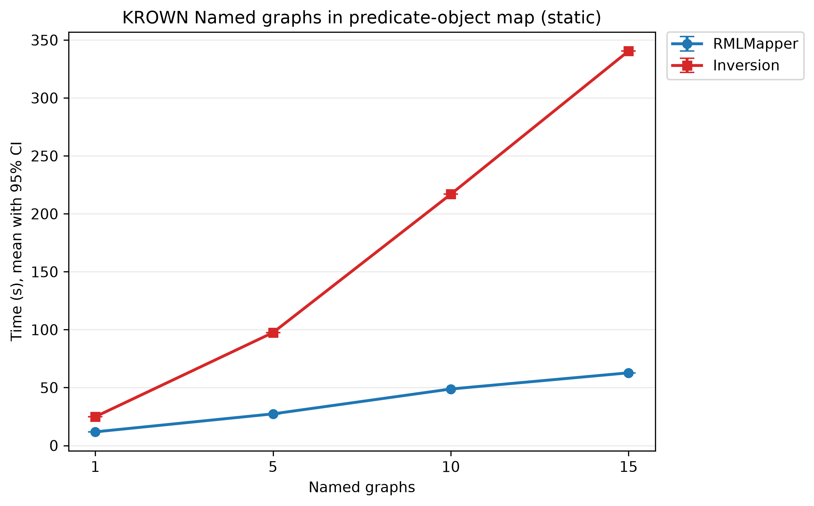

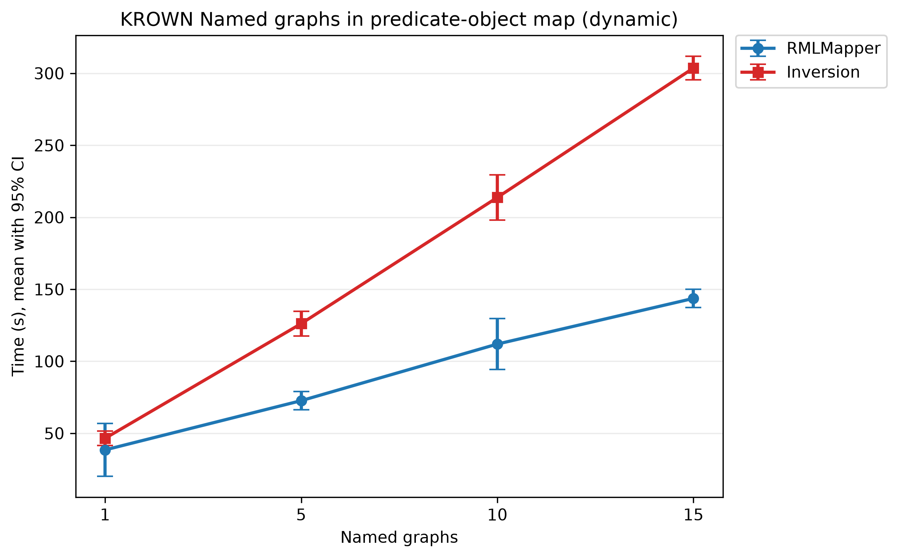

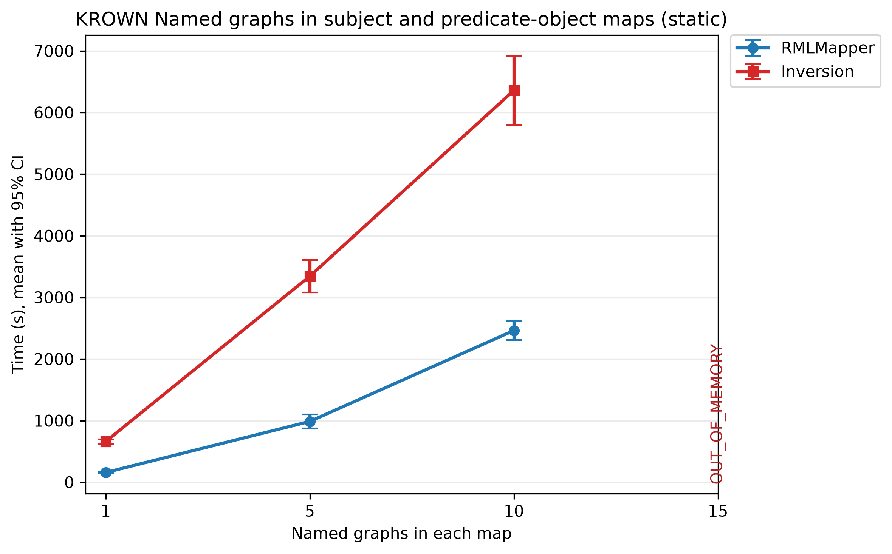

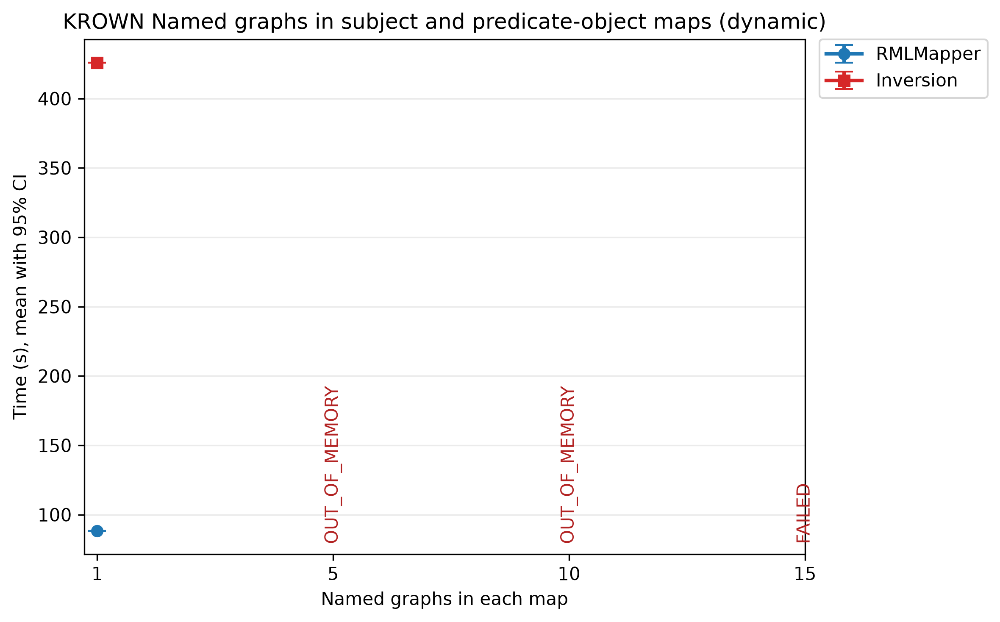

### Joins


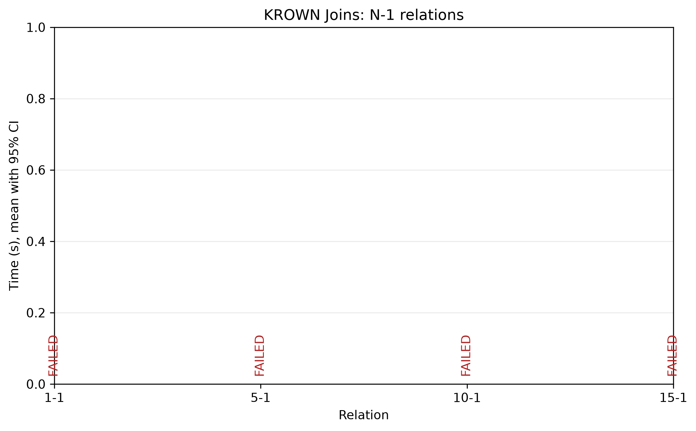

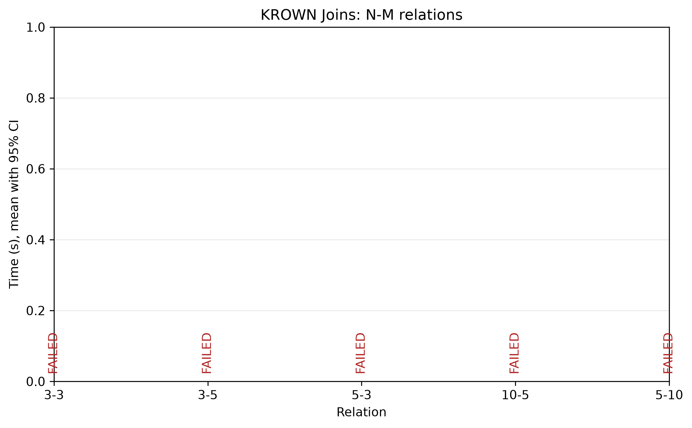

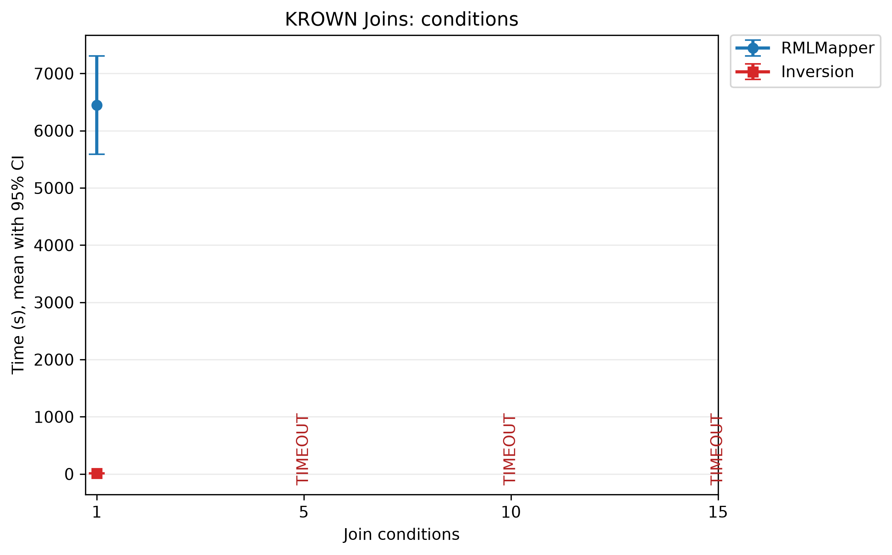

## Run

Run all suites with the default five iterations in `roundtrip` mode:

```bash
make benchmark-krown
```

`I` sets the number of iterations per scenario and must be odd and at least 3. Select a measurement mode and suites with `KROWN_MODE` and `KROWN_SUITES`:

```bash
make benchmark-krown I=3 KROWN_MODE=forward KROWN_SUITES=mappings,named-graphs
```

`KROWN_SUITES` accepts `raw`, `mappings`, `named-graphs`, and `joins`, and defaults to `all`. The 10M-row raw-data case and the 1M-row named-graph cases require the most time and disk space.

To rerun one scenario, copy its generated name from the benchmark output:

```bash
make benchmark-krown I=3 KROWN_MODE=backward KROWN_SCENARIO=namedgraph_0SM-NG_5POM-NG_1TM_1POM_True
```

`KROWN_SCENARIO` requires an exact name. When combined with `KROWN_SUITES`, the selected scenario must belong to one of those suites. Results, statistics, and plots contain only the selected scenario.

Change the system sampling interval with `KROWN_INTERVAL`, in seconds:

```bash
make benchmark-krown KROWN_INTERVAL=0.5
```

The runner generates one scenario at a time and removes it after its iterations. Each run creates a session directory under `benchmarks/krown/results/`. Forward artifacts are stored under each scenario's `forward/results/` directory. In `backward` mode, the unmeasured forward artifacts are kept under `preparation/results/`. Backward metrics are stored under `backward/results/`. The session also contains raw and aggregated JSON files, timing plots, and KROWN's `stats.csv`, `summary.csv`, and `aggregated.csv` files for each measured phase.
