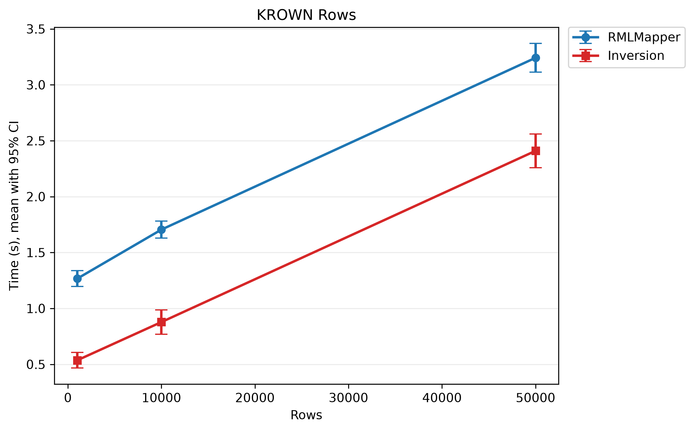
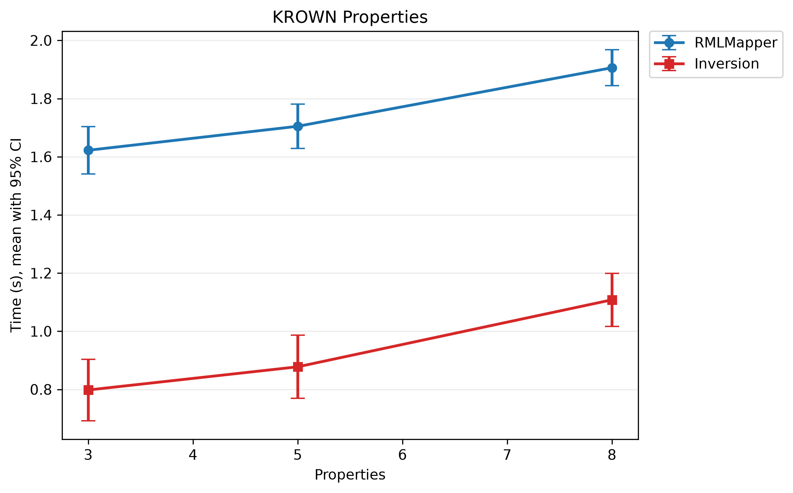

<!--
SPDX-FileCopyrightText: 2026 Arcangelo Massari <arcangelo.massari@unibo.it>

SPDX-License-Identifier: ISC
-->

# Benchmarking

The benchmark suite includes fully invertible [KROWN](https://github.com/kg-construct/KROWN) `RawData` scenarios and [GTFS Bench](https://github.com/oeg-upm/gtfs-bench) generated transit scenarios. Each run loads generated data into PostgreSQL, materializes RDF with RMLMapper, runs KGI inversion, and validates the reconstructed tables.

The KROWN benchmark varies one parameter at a time:

| Scenario | Rows | Properties | `value_size` | Series |
| --- | ---: | ---: | ---: | --- |
| `rows_low` | 1,000 | 5 | 100 | Rows |
| `baseline` | 10,000 | 5 | 100 | Rows, properties, value size |
| `rows_high` | 50,000 | 5 | 100 | Rows |
| `properties_low` | 10,000 | 3 | 100 | Properties |
| `properties_high` | 10,000 | 8 | 100 | Properties |
| `value_size_low` | 10,000 | 5 | 50 | Value size |
| `value_size_high` | 10,000 | 5 | 150 | Value size |

The benchmark stores seven distinct results. The same baseline result is shown in all three tables, so the documentation contains nine rows: seven distinct results and two repeated views of the baseline. Every KROWN iteration must reconstruct the column order, row count, values, and row multiplicities exactly.

GTFS scenarios use the official generated data and the official R2RML mapping without altering either one. The benchmark records the observed KGI outcome, including non-invertible or unsupported mappings.

## Run

The root Makefile provides the supported entry points:

```bash
make benchmark-krown I=10
```

```bash
make benchmark-gtfs I=10 S=1,5,10
```

```bash
make benchmark-all I=10 S=1,5,10
```

`I` is the number of iterations. `S` is a comma-separated list of GTFS scales.

## KROWN output

## PyOxyGraph run with ten iterations (2026-07-11)

### Rows

| Rows | CSV MiB | RDF triples | RMLMapper (s) | Inversion (s) | Overhead | Rows/s | Cells/s |
| ---: | ---: | ---: | ---: | ---: | ---: | ---: | ---: |
| 1,000 | 0.52 | 5,000 | 1.27 ± 0.07 | 0.54 ± 0.07 | 42.7 ± 6.3% | 1,912 | 11,472 |
| 10,000 | 5.29 | 50,000 | 1.70 ± 0.08 | 0.88 ± 0.11 | 51.4 ± 5.1% | 11,681 | 70,087 |
| 50,000 | 26.69 | 250,000 | 3.24 ± 0.13 | 2.41 ± 0.15 | 74.3 ± 3.8% | 20,893 | 125,360 |



### Properties

| Properties | CSV MiB | RDF triples | RMLMapper (s) | Inversion (s) | Overhead | Rows/s | Cells/s |
| ---: | ---: | ---: | ---: | ---: | ---: | ---: | ---: |
| 3 | 3.19 | 30,000 | 1.62 ± 0.08 | 0.80 ± 0.11 | 49.1 ± 5.3% | 12,899 | 51,594 |
| 5 | 5.29 | 50,000 | 1.70 ± 0.08 | 0.88 ± 0.11 | 51.4 ± 5.1% | 11,681 | 70,087 |
| 8 | 8.43 | 80,000 | 1.91 ± 0.06 | 1.11 ± 0.09 | 58.1 ± 4.3% | 9,134 | 82,202 |



### Value size

| Value size | CSV MiB | RDF triples | RMLMapper (s) | Inversion (s) | Overhead | Rows/s | Cells/s |
| ---: | ---: | ---: | ---: | ---: | ---: | ---: | ---: |
| 50 | 2.90 | 50,000 | 1.64 ± 0.08 | 0.84 ± 0.08 | 51.3 ± 4.8% | 12,076 | 72,456 |
| 100 | 5.29 | 50,000 | 1.70 ± 0.08 | 0.88 ± 0.11 | 51.4 ± 5.1% | 11,681 | 70,087 |
| 150 | 7.67 | 50,000 | 1.84 ± 0.06 | 0.96 ± 0.13 | 52.0 ± 5.7% | 10,724 | 64,346 |


